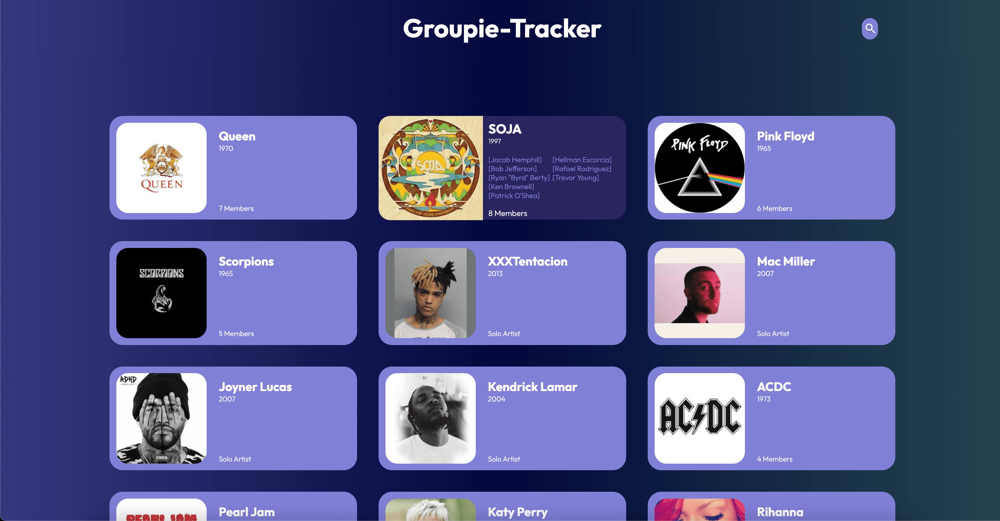
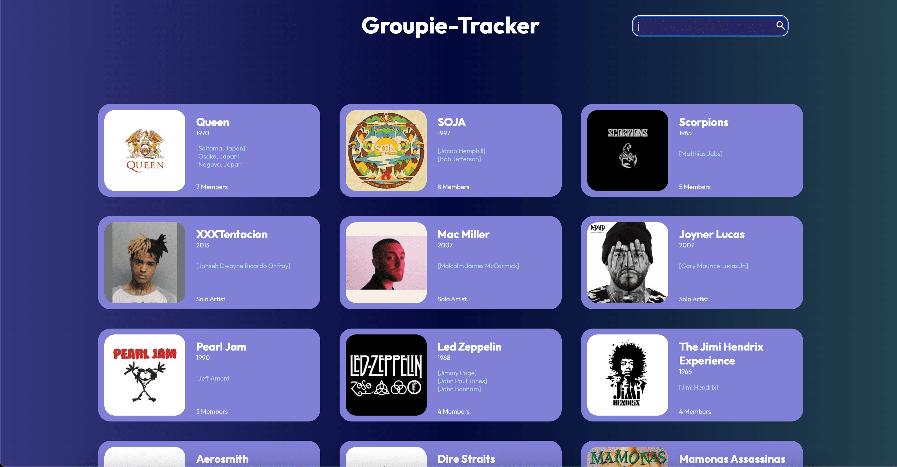
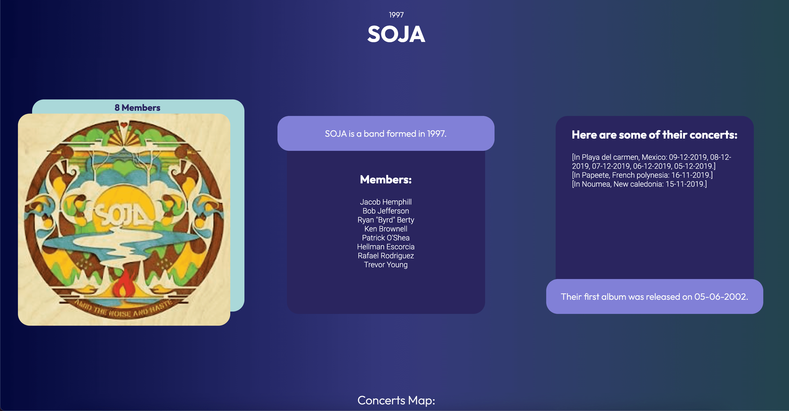
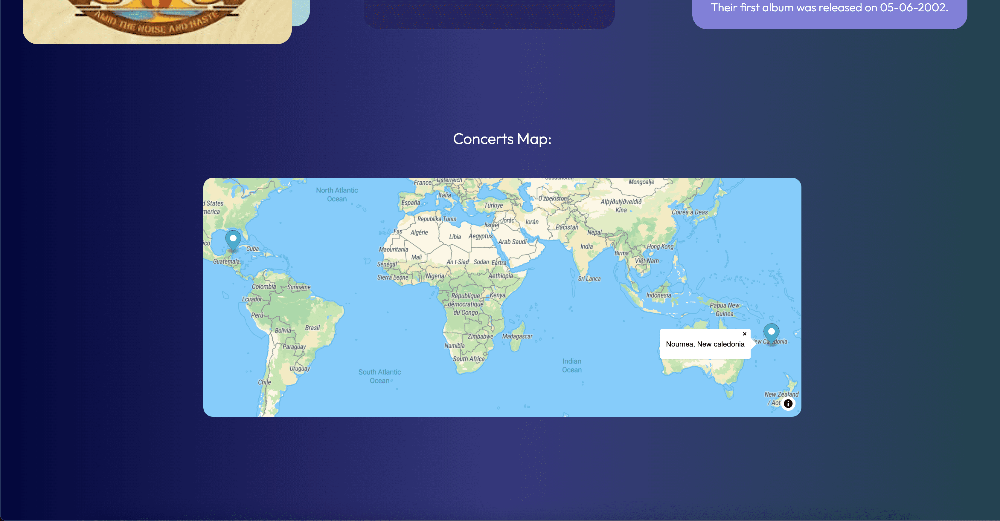

# Groupie Trackers

## Project Overview

**Groupie Trackers** is a full-stack web application built to display and visualize information about bands and artists, leveraging data from a RESTful API. This project showcases dynamic data handling, search functionality, and geolocation features, providing an interactive user experience.

### Features

- **Comprehensive Band/Artist Information**: Displays detailed data about artists, including names, images, members, start year, and first album.
- **Dynamic Search Bar**: A search bar that suggests results in real-time as the user types. It supports searching by artist/band name, members, concert locations, first album date, and creation date, with case-insensitive input handling.
- **Geolocation Mapping**: Visualizes concert locations using geolocation markers on an interactive map.
- **Client-Server Communication**: Utilizes event-driven architecture for client-server interactions to retrieve and display relevant data.
- **Error Handling**: Robust error handling for all pages and backend processes.

---

## Home Page
_Display your application's homepage here, highlighting the overall design and layout._

---

## Search Bar
_Showcase the search bar with dynamic suggestions in action._

---

## Artist Page
_Show the artist page, including details like band members, first album, and more._

---

## Geolocation Map (Artist Page)
_Highlight the interactive geolocation map that displays concert locations._

---

## Technologies Used

- **Backend**: Written in Go, ensuring performance and concurrency in handling multiple API requests.
- **Frontend**: Built using HTML, CSS, and JavaScript, focusing on user-friendly data visualizations.
- **Geolocation API**: Converts concert locations into geographic coordinates and displays them on a map.
- **Data Handling**: Manipulates and stores JSON data from the API, efficiently linking artists, dates, and locations.

---

## Key Learnings

This project helped me develop a deeper understanding of:
- **Data manipulation**: Processing and displaying large datasets efficiently.
- **Client-server architecture**: Managing API requests and dynamically rendering content.
- **Geolocation integration**: Converting real-world addresses into coordinates and mapping them.
- **Search optimization**: Implementing case-insensitive search functionality with dynamic typing suggestions.

---

## Instructions

To run this project locally:
1. Clone the repository.
2. Run the Go backend server.
3. Open the website in your browser to explore the various features.

---

This project demonstrates my ability to create fully interactive web applications, handle real-time data updates, and build intuitive user interfaces. You can explore the full project to see these features in action.
